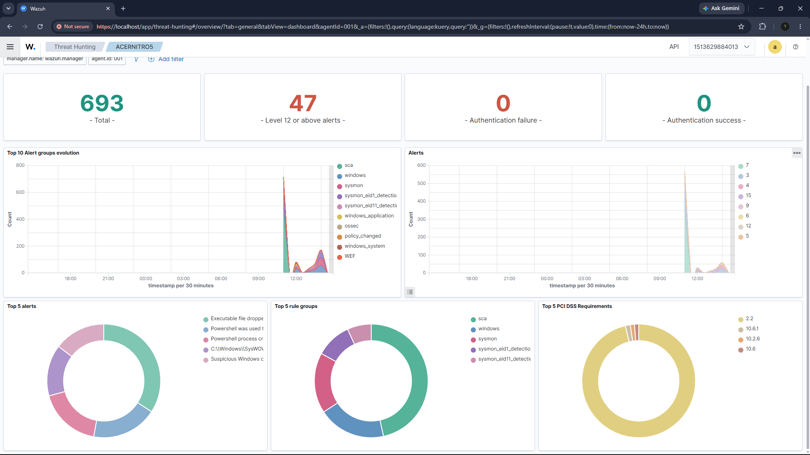
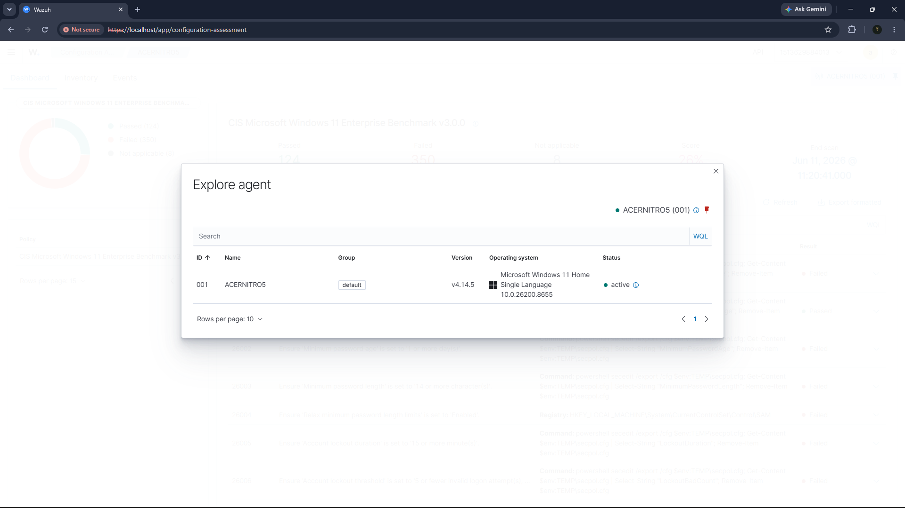
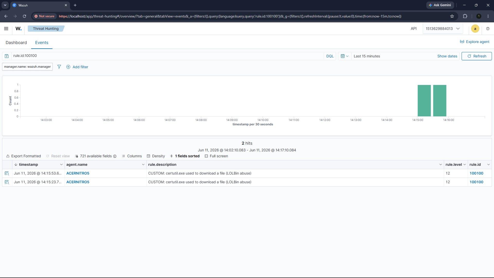
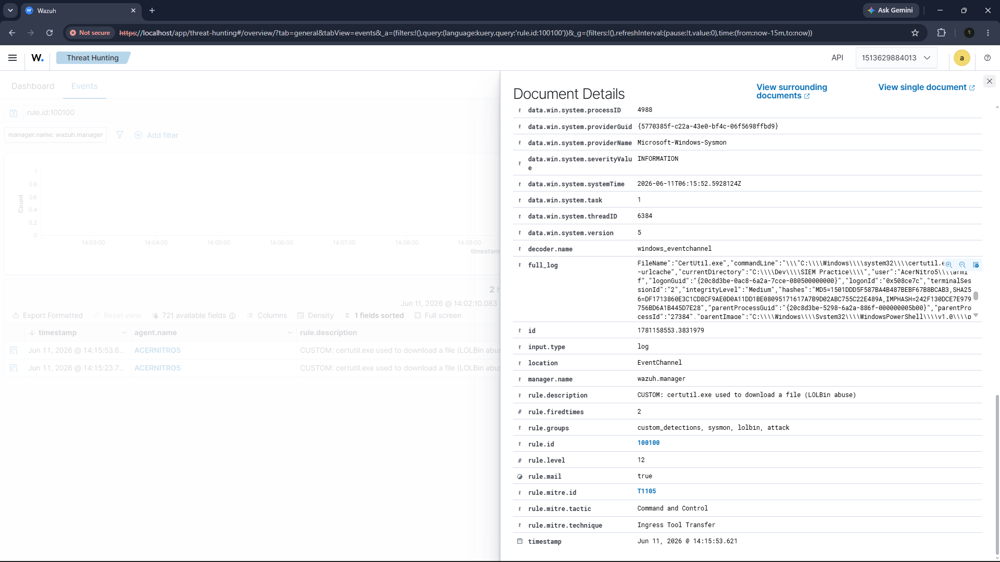
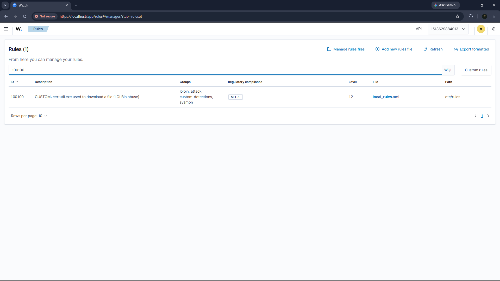
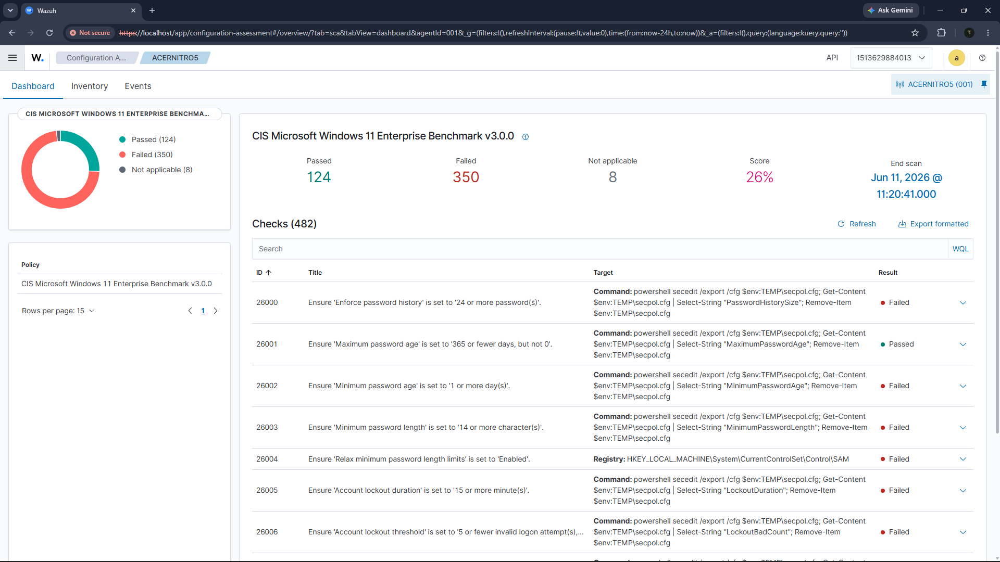

# Wazuh SIEM Home Lab

A self-hosted **SIEM (Security Information and Event Management)** lab built with
[Wazuh](https://wazuh.com/) 4.14.5, monitoring a live Windows endpoint. It
deploys the full Wazuh stack in Docker, onboards a real Windows machine as an
agent, ingests **Windows Event Logs + Sysmon** telemetry, and demonstrates the
core SOC-analyst workflow: **detect -> triage -> tune -> respond.**

This is the **SIEM / platform layer** of my detection portfolio. It sits above
the rule-engine projects:
- **Sigma** rules -> SIEM log detection
- **YARA** rules -> file/malware detection
- **Suricata** rules -> network detection
- **Wazuh (this project)** -> the platform that collects, correlates, alerts on, and visualises it all.



*The Wazuh dashboard (Threat Hunting) — live alert volume, top detection rules, and MITRE ATT&CK coverage for the monitored endpoint.*

---

## What this project demonstrates

| Skill | How |
|---|---|
| **SIEM deployment & administration** | Deployed Wazuh manager + indexer (OpenSearch) + dashboard via Docker |
| **Endpoint onboarding** | Installed the Wazuh agent on Windows, auto-enrolled, centrally managed |
| **Log collection** | Forwarded Windows Event Logs + **Sysmon** to the SIEM |
| **Detection engineering** | Wrote custom Wazuh rules (XML), MITRE-mapped |
| **Alert triage** | Investigated alerts, identified a false positive, documented a verdict |
| **Detection tuning** | Wrote a rule to suppress a known false positive |
| **Compliance & hardening** | Used built-in SCA (CIS Windows 11 benchmark) + PCI/NIST mapping |
| **Infrastructure / Docker** | Container orchestration, resource tuning on constrained hardware |

---

## Architecture

```
   WINDOWS ENDPOINT (ACERNITRO5)                 WAZUH SERVER (Docker)
   +----------------------------+   logs 1514   +-----------------------------+
   |  Wazuh Agent               | ------------> |  Manager   (analyses, rules)|
   |   - Windows Event Logs     |   enroll 1515 |     |                         |
   |   - Sysmon (process/net)   |               |     v                         |
   +----------------------------+               |  Indexer   (OpenSearch DB)  |
                                                |     |                         |
                                                |     v                         |
                                                |  Dashboard (web UI :443)    |
                                                +-----------------------------+
                                                    https://localhost
```

The endpoint is a **sensor**; the manager **analyses & alerts**; the indexer
**stores & searches**; the dashboard **visualises**.



*The Windows endpoint (ACERNITRO5) onboarded as an agent and reporting as **Active**.*

---

## Detection engineering

Custom rules live in [`rules/local_rules.xml`](rules/local_rules.xml) (rule IDs in
the 100000+ user range).

### Custom detection rule

| Rule ID | Level | Detects | MITRE |
|---|---|---|---|
| **100100** | 12 (high) | `certutil.exe` downloading a file ("living off the land" - a trusted Windows binary abused to fetch malware) | **T1105** Ingress Tool Transfer |

It hooks onto Wazuh's base Sysmon process-creation rule (`61603`) and matches on
the process image (`certutil`) plus the download flag (`urlcache`).



*Rule 100100 firing end-to-end — certutil activity on ACERNITRO5 caught at **level 12** and tagged **MITRE T1105**.*



*The expanded alert: full command line, rule metadata, and ATT&CK mapping.*



*Both custom rules deployed and visible in the Wazuh ruleset (Server Management → Rules).*

### Custom tuning rule (false-positive suppression)

| Rule ID | Level | Action | Why |
|---|---|---|---|
| **100200** | 0 (silenced) | Overrides built-in rule `92213` for `__PSScriptPolicyTest_*.ps1` | Those files are created by PowerShell itself on every run - benign |

### Built-in detections observed (out of the box)

- **Discovery activity executed** (`net user`, `net localgroup`, `whoami`) - MITRE T1087 / T1057 / T1082
- **PowerShell-spawned discovery** - T1059.001
- **SCA** - CIS Microsoft Windows 11 Benchmark compliance scan
- Automatic mapping to **PCI DSS, NIST, HIPAA, GDPR**



*Built-in Security Configuration Assessment scoring the endpoint against the CIS Microsoft Windows 11 benchmark.*

---

## Defense-in-depth in action (EDR + SIEM)

While testing the certutil detection, I tried the real attack form
(`certutil -urlcache -split -f <url>` - downloading a file). **Windows Defender
blocked it outright** ("Access is denied"; Defender threat detections logged at
the exact attempt times).

That is **defense-in-depth working as designed:**

> The **endpoint EDR (Defender)** killed the living-off-the-land attack *before
> the process started* - so the **SIEM (Wazuh)** never saw it. The first layer
> stopped the threat; the second layer is there for when the first is evaded or
> absent.

It also surfaces a real telemetry nuance: a SIEM rule can only fire on activity
its sensors actually observe. If an upstream control blocks the process at
creation, there is no process-creation event to alert on. The Wazuh rule earns
its keep on endpoints where Defender is disabled, evaded, or not present - which
is exactly why layered detection matters. (The rule is validated against the
benign `certutil -urlcache` form, which Defender permits.)

---

## A real triage example (false positive)

During testing, several **Level 15 (critical)** alerts fired:
*"Executable file dropped in folder commonly used by malware" (T1105).*

**Triage (4 questions):**
1. **What fired?** A script was dropped in `%TEMP%`.
2. **What's the evidence?** The file was `__PSScriptPolicyTest_xxxxx.ps1`, created by `powershell.exe`.
3. **Innocent explanation?** Yes - PowerShell creates this file itself, every run, to test its execution policy, then deletes it.
4. **Verdict + action?** **False positive.** No threat. Action: wrote tuning rule `100200` to silence it.

Severity is a starting point, not a verdict - this is the core skill the lab practises.

---

## Quickstart

> Requires Docker Desktop. Built/tested on Windows 11 with the WSL2 backend.

```powershell
# 0. One-time: clone the official Wazuh single-node stack into this folder, then
#    lower the indexer heap to 512m (OPENSEARCH_JAVA_OPTS) in
#    wazuh-docker/single-node/docker-compose.yml
git clone https://github.com/wazuh/wazuh-docker.git -b v4.14.5

# 1. Start the SIEM (manager + indexer + dashboard)
powershell -File start-lab.ps1

# 2. Open https://localhost   (admin / SecretPassword)

# 3. Install the agent on this PC (run elevated) - one time
msiexec.exe /i wazuh-agent-4.14.5-1.msi /q WAZUH_MANAGER="127.0.0.1" `
  WAZUH_REGISTRATION_SERVER="127.0.0.1" WAZUH_AGENT_NAME="$env:COMPUTERNAME"
NET START WazuhSvc

# 4. Load the custom detection + tuning rules
powershell -File load-rules.ps1

# 5. Fire the safe attack simulation and watch alerts in the dashboard
powershell -File test-detections.ps1

# 6. Stop the lab (frees RAM, keeps all data)
powershell -File stop-lab.ps1
```

Sysmon collection is pushed **centrally** from the manager via
[`agent.conf`](agent.conf) (shared `default` group) - the fleet-management
approach, rather than editing each endpoint by hand.

---

## Resource notes (honest lessons learned)

This lab was built on a **7.2 GB RAM** laptop - well below the comfortable
spec for a full SIEM. Real takeaways:

- A full Wazuh stack wants ~3 GB; production SIEMs run on **dedicated servers**, not daily-driver laptops.
- Tuned the indexer JVM heap down to **512 MB** (`OPENSEARCH_JAVA_OPTS=-Xms512m -Xmx512m` in the single-node `docker-compose.yml`) for a small lab.
- Set **`autoMemoryReclaim`** in `.wslconfig` so WSL2 returns idle memory to Windows (it hoards by default).
- Run the lab in **focused sessions** and `stop-lab.ps1` when done.

These constraints are themselves a useful systems-administration exercise.

---

## Repo structure

```
wazuh-siem-lab/
  rules/local_rules.xml      # custom detection + tuning rules
  agent.conf                 # centralised Sysmon collection (shared group)
  start-lab.ps1              # bring the stack up
  stop-lab.ps1               # stop it, free RAM, keep data
  load-rules.ps1             # deploy rules to the manager + reload
  test-detections.ps1        # safe attack simulation
  install-agent.ps1          # agent install (record)
  SOLO-TEST-CHECKLIST.md     # step-by-step demo/screenshot guide
  wazuh-docker/              # official Wazuh stack - cloned separately (gitignored), see Quickstart
  screenshots/               # dashboard evidence
```

## Tech stack

Wazuh 4.14.5 - OpenSearch - Docker / Docker Compose - Sysmon - Windows Event
Logs - MITRE ATT&CK - PowerShell - WSL2

---

*Built by Armi Fahim as part of a SOC-analyst portfolio. Safe, synthetic test
activity only - no real malware.*
